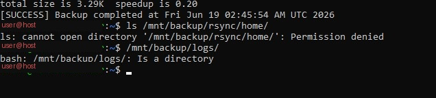

# Incident Report: 3-2-1 Backup Lab

This document records real issues encountered while building this lab, how they were diagnosed, and how they were resolved. These are kept as part of the portfolio deliberately — troubleshooting real, unscripted failures is a more accurate signal of practical skill than a guide that never breaks.

---

## Incident 1: rsync permission denied on root-owned Docker volume files

**Symptom:**

```
rsync: [sender] opendir "/home/[user]/webserver/wazuh-docker/single-node/config/wazuh_indexer_ssl_certs" failed: Permission denied (13)
rsync: [sender] send_files failed to open "/home/[user]/pihole-lab/volumes/pihole/etc-pihole/logrotate": Permission denied (13)
rsync error: some files/attrs were not transferred (see previous errors) (code 23)
```

**Root cause:**

Docker containers frequently create files inside their bind-mounted volumes owned by `root` or by a container-internal UID, regardless of which user owns the parent directory. rsync running as a normal user cannot read these files.

**Resolution:**

This is documented as an **accepted limitation**, not fixed. Running the backup as root would resolve it but introduces broader risk (a compromised backup script running as root has much higher blast radius). The tradeoff was consciously made to exclude these specific internal container files from the user-level backup, since the container configurations themselves are reproducible from their `docker-compose.yml` definitions, which are backed up successfully.

**Portfolio note:** worth being able to explain this tradeoff explicitly in an interview — it's a legitimate security-vs-completeness decision, not an oversight.

---

## Incident 2: Root-owned directory blocking the entire backup destination

**Symptom:**

```
$ ls /mnt/backup/rsync/home/
ls: cannot open directory '/mnt/backup/rsync/home/': Permission denied
```

Despite the backup script reporting `[SUCCESS]`.

**Root cause:**

```
$ sudo ls -l /mnt/backup/rsync/home/
drwx------ 3 root root 4096 Jun 12 20:53 snap
```

A `snap` directory had been created inside the backup destination, owned by `root:root` with no group/other permissions — likely from an unrelated snap package activity that bind-mounted into that path at some point. This blocked the normal user from listing the directory at all, even though rsync itself had silently succeeded in writing the rest of the backup elsewhere in the tree.

**Resolution:**

```bash
sudo chown -R [user]:[user] /mnt/backup
sudo chmod -R 770 /mnt/backup
```



*The permission denied error appearing immediately after a `[SUCCESS]` backup, and the ownership fix that resolved it.*

**Lesson:** a backup script reporting success doesn't guarantee the destination is fully usable. This incident is part of why [Phase 5](PHASE5-verify-restore.md) treats an actual restore test as the real proof of a working backup, not just a clean exit code.

---

## Incident 3: Restic password file permission mismatch (three separate failures)

**Symptom, attempt 1:**

```
$ restic backup --repo /mnt/backup/restic/home-repo --password-file ~/.restic-password ...
Resolving password failed: Fatal: /home/[user]/.restic-password does not exist
```

**Symptom, attempt 2** (after creating the file at a different path):

```
$ restic backup --repo /mnt/backup/restic/home-repo --password-file /etc/restic-password ...
Resolving password failed: Readfile: open /etc/restic-password: permission denied
```

**Symptom, attempt 3** (worked, but masked the real problem):

```
$ sudo restic backup --repo /mnt/backup/restic/home-repo --password-file /etc/restic-password ...
repository 74a3caff opened successfully, password is correct
```

**Root cause:**

The password file had been created at `/etc/restic-password`, which defaults to root ownership. Running the command with `sudo` "fixed" it for manual testing, but **cron jobs do not run as root** — they run as the user who owns the crontab. This meant the nightly automated Restic backup would have failed silently every single night, while every manual test (run with `sudo`) appeared to work fine.

**Resolution:**

```bash
sudo chown [user]:[user] /etc/restic-password
chmod 600 /etc/restic-password

# Verified the fix by testing WITHOUT sudo -- this is the only valid test,
# since it's what cron will actually do:
restic backup --repo /mnt/backup/restic/home-repo --password-file /etc/restic-password ...
```

**A second related issue surfaced during this debugging:** an extra Restic repository was accidentally initialized at `/mnt/backup/restic-repo` (a typo'd path, distinct from the intended `/mnt/backup/restic/home-repo`) while testing different password file locations. This created two parallel repositories — one empty, one with the real verified snapshot — which had to be reconciled:

```bash
# Confirmed which repo actually had the data
restic snapshots --repo /mnt/backup/restic/home-repo --password-file /etc/restic-password
restic snapshots --repo /mnt/backup/restic-repo --password-file /etc/restic-password

# Removed the accidental duplicate
sudo rm -rf /mnt/backup/restic-repo
```

**Lesson:** always test automation-facing commands in the exact context they'll actually run in (same user, no sudo), not just "does this command succeed somehow." `setup.sh` in this repo bakes in the corrected permission handling so this can't recur.

---

## Incident 4: Wazuh agent event queue flooding

**Symptom:**

```
** Alert 1781877399.6840671: - wazuh,agent_flooding,pci_dss_10.6.1,gdpr_IV_35.7.d,
2026 Jun 19 13:56:39 ([hostname]) any->wazuh-agent
Rule: 203 (level 9) -> 'Agent event queue is full. Events may be lost.'
wazuh: Agent buffer: 'full'.
```

Firing continuously, roughly every 2 seconds.

**Root cause:**

The Wazuh agent had been configured to monitor backup logs using a wildcard:

```xml
<location>/mnt/backup/logs/*.log</location>
```

The rsync script generates a new, uniquely timestamped log file on every run (`rsync_2026-06-19_02-44-53.log`, etc.). Over repeated testing, this directory accumulated a large number of files. Wazuh's logcollector has to track every file matching a wildcard individually, and the growing file count combined with frequent re-scans saturated the agent's event queue, causing active event loss — meaning the SIEM was failing at its actual job during this period.

**Resolution:**

Replaced the wildcard with explicit, named, stable log file paths (one per backup job type) in `ossec.conf`, as documented in [Phase 6](PHASE6-wazuh-integration.md). This keeps the number of monitored files fixed regardless of how many timestamped logs accumulate.

Also cleaned up the accumulated log files to prevent future bloat:

```bash
find /mnt/backup/logs/ -name "rsync_*.log" -mtime +7 -delete
```

**Lesson:** a wildcard log path that seems convenient can become an operational liability once a script generates many small files over time. Named files are slightly more verbose to configure but far more predictable at scale.

---

## Incident 5: Windows SMB session conflict (error 1219)

**Symptom:**

```
C:\Users\[User]>net use Z: \\192.168.1.X\NetworkBackup [password] /user:backupuser /persistent:yes
System error 1219 has occurred.
Multiple connections to a server or shared resource by the same user, using more than one user name, are not allowed.
```

**Root cause:**

An earlier failed connection attempt via File Explorer (browsing the raw UNC path without proper credentials) had left a stale, differently-authenticated session cached by Windows. Windows refuses to hold two sessions to the same server under different identities simultaneously.

**Resolution:**

```cmd
net use * /delete /y
net use Z: \\192.168.1.X\NetworkBackup /user:backupuser [password] /persistent:yes
```

**Status:** this is part of the in-progress Windows automation work, documented here for completeness since it was encountered during this lab's broader troubleshooting session. Full Windows-side writeup (Task Scheduler + robocopy) will follow once that phase is independently verified end-to-end.

---

## Summary

Five distinct incidents across the server-side build, all resolved and verified:

| # | Issue | Category |
|---|---|---|
| 1 | rsync can't read root-owned Docker volume files | Accepted limitation, documented tradeoff |
| 2 | Root-owned directory blocked backup destination | Permissions bug, fixed |
| 3 | Restic password file ownership broke cron silently | Permissions bug + accidental duplicate repo, fixed |
| 4 | Wazuh agent queue flooded from wildcard log monitoring | Configuration bug, fixed |
| 5 | Windows SMB stale session conflict | Client-side issue, fixed (Windows automation in progress) |

None of these were caught by "it ran without an error message" — they were caught by actually checking the output (`ls` after a successful backup), testing as the right user, watching the SIEM dashboard, and reading Windows error codes literally instead of guessing.
