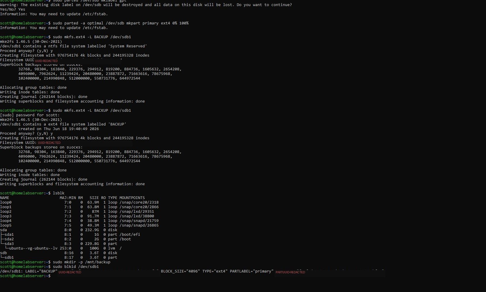

# Phase 1: Mounting the 5TB External HDD

## Goal

Get the external USB HDD permanently mounted at `/mnt/backup` so it survives reboots, with a clean directory structure ready for the backup tools used in later phases.

## Steps

### 1. Identify the drive

```bash
lsblk
```

Look for the drive matching your external HDD's size (a 5TB drive typically shows as `4.6T` due to how drive manufacturers calculate capacity vs. how Linux reports it).

### 2. Partition and format

The drive in this build had a leftover NTFS "System Reserved" partition from a previous Windows use. It was repartitioned cleanly with `parted` and formatted as ext4:

```bash
sudo parted /dev/sdb mklabel gpt
sudo parted -a optimal /dev/sdb mkpart primary ext4 0% 100%
sudo mkfs.ext4 -L BACKUP /dev/sdb1
```

> **Note:** This erases all data on the drive. Back up anything important first.

### 3. Create the mount point and get the drive's UUID

```bash
sudo mkdir -p /mnt/backup
sudo blkid /dev/sdb1
```

Copy the `UUID` value from the output — you'll need it for the next step.

### 4. Add a permanent fstab entry

```bash
sudo nano /etc/fstab
```

Add this line at the bottom (replace the UUID with yours):

```
UUID=your-actual-uuid-here  /mnt/backup  ext4  defaults,nofail  0  2
```

The `nofail` option ensures the server still boots normally even if the drive isn't plugged in.

### 5. Mount and verify

```bash
sudo mount -a
df -h /mnt/backup
```

### 6. Create the directory structure

```bash
sudo mkdir -p /mnt/backup/rsync
sudo mkdir -p /mnt/backup/restic
sudo mkdir -p /mnt/backup/network
sudo mkdir -p /mnt/backup/logs
sudo chown -R $USER:$USER /mnt/backup
sudo chmod -R 770 /mnt/backup
```

## Screenshot



*Partitioning, formatting, and confirming the mount via `lsblk` and `blkid`. UUID and PARTUUID values are redacted.*

## Verification checklist

- [ ] `df -h /mnt/backup` shows the 5TB drive mounted with ~4.5TB available
- [ ] `/mnt/backup/rsync`, `/mnt/backup/restic`, `/mnt/backup/network`, `/mnt/backup/logs` all exist
- [ ] A reboot test confirms the drive auto-mounts without manual intervention

## Next

[Phase 2: rsync backups + cron automation →](PHASE2-rsync-cron.md)
