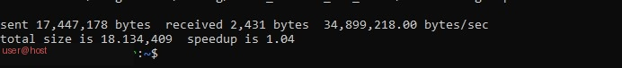

# Phase 2: rsync Backups + Cron Automation

## Goal

Get an incremental, automated backup of the server's home directory running nightly with zero manual intervention.

## Why rsync

rsync compares source and destination at the block level. The first run copies everything; every subsequent run only copies what changed. This makes nightly backups of a multi-GB home directory complete in seconds once the initial sync is done.

## The backup script

See [`../backup_rsync.sh`](../backup_rsync.sh) for the full script. Key points:

- Checks that `/mnt/backup` is actually mounted before attempting anything (prevents a broken backup if the HDD isn't connected)
- Logs every run to a timestamped file in `/mnt/backup/logs/`
- Uses `--delete` to keep the backup an exact mirror (files deleted from source are removed from the backup too)
- Excludes `.cache` and `.local/share/Trash` since these are disposable

Place the script at `~/backup_rsync.sh` and make it executable:

```bash
chmod +x ~/backup_rsync.sh
```

## Scheduling with cron

```bash
crontab -e
```

Add:

```
0 2 * * * /home/[your-username]/backup_rsync.sh >> /mnt/backup/logs/cron.log 2>&1
```

This runs the backup every night at 2:00 AM and logs all output (including the script's own internal logging) to `cron.log`.

Verify cron itself is running:

```bash
sudo systemctl status cron
```

## Screenshot



*A completed rsync run after the initial backup, showing the speedup from incremental syncing — only the changed bytes were transferred.*

## A known, accepted limitation

Running as a normal user (not root), rsync cannot read files owned by `root` inside Docker volumes (for example, Wazuh's internal SSL certificate directory, or SQLite lock files inside a Pi-hole container's volume). This produces `rsync error: some files/attrs were not transferred (code 23)` and is expected — see [INCIDENT-REPORT.md](INCIDENT-REPORT.md) for the full writeup. Full coverage of those specific files would require running the backup as root, which introduces its own tradeoffs and wasn't adopted for this lab.

## Verification checklist

- [ ] Manual run of `~/backup_rsync.sh` completes and shows `[SUCCESS]` in the log
- [ ] `ls /mnt/backup/rsync/home/` shows a mirrored copy of the home directory
- [ ] `crontab -l` shows the scheduled job
- [ ] `sudo systemctl status cron` shows the service active

## Next

[Phase 3: Samba network share →](PHASE3-samba-share.md)
