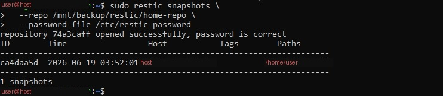
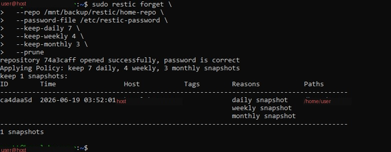

# Phase 4: Encrypted Backups with Restic

## Goal

Add AES-256 encrypted, deduplicated snapshot backups on top of the plain rsync mirror — protecting data at rest in case the physical HDD is ever lost or stolen, and adding point-in-time recovery via snapshots.

## Why Restic on top of rsync

rsync copies files as plain, readable data. If the HDD is stolen, anyone can read it directly. Restic encrypts every backup chunk with AES-256-CTR before it touches the disk, and deduplicates data across snapshots — if the same file exists in ten backups, it's only stored once.

## Setup

```bash
sudo apt install -y restic
```

### Initialize the repository

```bash
restic init --repo /mnt/backup/restic/home-repo
```

You'll be prompted to set an encryption password. **This password is the only way to access the backup data — losing it means losing the backups irrecoverably.** Store it in a password manager.

### Password file for automation

For unattended (cron) backups, Restic needs the password without a human typing it:

```bash
echo "your-restic-password" > /etc/restic-password
sudo chown $USER:$USER /etc/restic-password
chmod 600 /etc/restic-password
```

> **This step matters more than it looks.** See [INCIDENT-REPORT.md](INCIDENT-REPORT.md) for a detailed account of how getting this ownership wrong caused three separate silent failures during the original build. The password file must be owned by the same user that cron runs the job as — not root — or every automated backup will fail with `permission denied` while still appearing to "work" if tested manually with `sudo`.

### Run a backup

```bash
restic backup --repo /mnt/backup/restic/home-repo --password-file /etc/restic-password --exclude='.cache' $HOME
```

### List snapshots

```bash
restic snapshots --repo /mnt/backup/restic/home-repo --password-file /etc/restic-password
```

## Screenshot



*A verified snapshot, confirming the repository password is correct and the backup completed.*

## Retention policy

Without limits, Restic would keep every snapshot forever and eventually fill the drive. A retention policy prunes old snapshots automatically while preserving a sensible history:

```bash
restic forget \
  --repo /mnt/backup/restic/home-repo \
  --password-file /etc/restic-password \
  --keep-daily 7 \
  --keep-weekly 4 \
  --keep-monthly 3 \
  --prune
```

## Screenshot



*The retention policy being applied, showing which snapshots are kept and why (daily/weekly/monthly designation).*

## Scheduling

```bash
crontab -e
```

Add:

```
5 2 * * * restic backup --repo /mnt/backup/restic/home-repo --password-file /etc/restic-password --exclude='.cache' $HOME >> /mnt/backup/logs/restic_home.log 2>&1
15 2 * * * restic forget --repo /mnt/backup/restic/home-repo --password-file /etc/restic-password --keep-daily 7 --keep-weekly 4 --keep-monthly 3 --prune >> /mnt/backup/logs/restic_prune.log 2>&1
```

## Verification checklist

- [ ] `restic snapshots ... --password-file /etc/restic-password` (run **without sudo**) lists at least one snapshot — this confirms cron will be able to do the same
- [ ] `restic forget ... --prune` runs cleanly and reports the retention policy applied
- [ ] `crontab -l` shows both scheduled jobs

## Next

[Phase 5: Verification and restore testing →](PHASE5-verify-restore.md)
