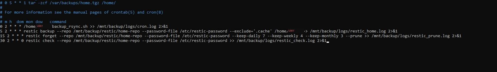

# Phase 5: Verification and Restore Testing

## Goal

Prove the backups actually work — not just that they run without error, but that data can genuinely be recovered from them. An untested backup is not a backup.

## Integrity checking

Restic has a built-in check that verifies every encrypted chunk against its hash:

```bash
restic check --repo /mnt/backup/restic/home-repo --password-file /etc/restic-password
```

A clean run ends with `no errors were found`.

## The restore test

The real test: delete something, then restore it from a snapshot.

```bash
# Create a test file
echo "restore test - $(date)" > ~/restore_test.txt

# Back it up
restic backup --repo /mnt/backup/restic/home-repo --password-file /etc/restic-password $HOME

# Delete it
rm ~/restore_test.txt

# Find the snapshot ID
restic snapshots --repo /mnt/backup/restic/home-repo --password-file /etc/restic-password

# Restore from that snapshot
restic restore <snapshot-id> \
  --repo /mnt/backup/restic/home-repo \
  --password-file /etc/restic-password \
  --target ~/restore-test/
```

This was run end-to-end during the original build: a snapshot was created, a full directory tree was deleted, and the data was successfully restored to a separate target directory with file ownership and timestamps intact.

## Scheduling integrity checks

```bash
crontab -e
```

Add:

```
30 2 * * 0 restic check --repo /mnt/backup/restic/home-repo --password-file /etc/restic-password >> /mnt/backup/logs/restic_check.log 2>&1
```

This runs every Sunday at 2:30 AM.

## Final crontab

By this phase, four scheduled jobs are running the full backup lifecycle automatically:



*rsync nightly, Restic backup nightly, Restic prune nightly, and Restic integrity check weekly — usernames in file paths are redacted.*

## Recovery objectives validated

- **RPO: 24 hours** — backups run nightly, so worst-case data loss is one day
- **RTO: under 1 hour** — the restore test above, including locating the snapshot and restoring a full directory tree, took well under an hour from start to finish

## Verification checklist

- [ ] `restic check` reports no errors
- [ ] A deliberately deleted file or directory was successfully restored from a snapshot
- [ ] Weekly integrity check is scheduled and confirmed running via cron

## Next

[Phase 6: Wazuh SIEM integration →](PHASE6-wazuh-integration.md)
