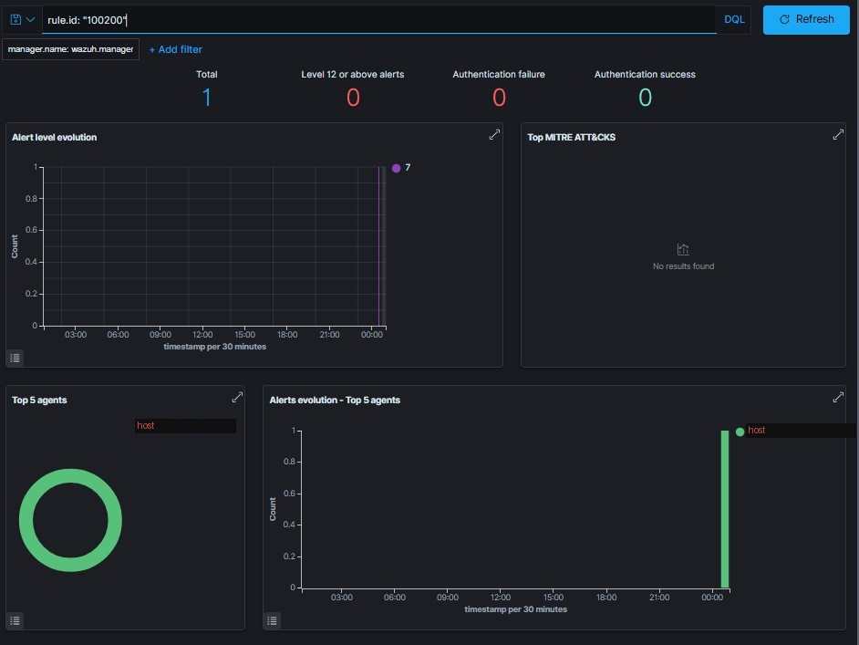

# Phase 6: Wazuh SIEM Integration

## Goal

Connect backup logs to the existing Wazuh SIEM deployment so backup failures generate real security alerts — treating backup health as a monitored operational control, not something checked manually after the fact.

## Why this matters

Backup failures are a security-relevant event. Ransomware frequently targets backups specifically, and a SOC analyst's job includes noticing when a control silently stops working. Piping backup logs into the SIEM and alerting on failure closes that gap.

## Configuring log monitoring

Edit the Wazuh agent config:

```bash
sudo nano /var/ossec/etc/ossec.conf
```

Add named log file locations inside a `<localfile>` block:

```xml
<localfile>
  <log_format>syslog</log_format>
  <location>/mnt/backup/logs/cron.log</location>
</localfile>
<localfile>
  <log_format>syslog</log_format>
  <location>/mnt/backup/logs/restic_home.log</location>
</localfile>
<localfile>
  <log_format>syslog</log_format>
  <location>/mnt/backup/logs/restic_prune.log</location>
</localfile>
<localfile>
  <log_format>syslog</log_format>
  <location>/mnt/backup/logs/restic_check.log</location>
</localfile>
```

> **Important — use named files, not a wildcard.** An earlier version of this config used `<location>/mnt/backup/logs/*.log</location>`, which caused the Wazuh agent's event queue to flood continuously (rule 203, "Agent event queue is full"). The rsync script's timestamped log filenames meant the wildcard was matching a growing number of files over time. See [INCIDENT-REPORT.md](INCIDENT-REPORT.md) for the full diagnosis. Pointing at specific, stable filenames avoids this entirely.

```bash
sudo systemctl restart wazuh-agent
```

## Custom alert rules

```bash
sudo nano /var/ossec/etc/rules/local_rules.xml
```

Add inside an existing `<group>` block:

```xml
<rule id="100200" level="7">
  <if_sid>1002</if_sid>
  <match>FAILURE</match>
  <description>Backup script reported a failure</description>
  <group>backup,availability</group>
</rule>

<rule id="100201" level="5">
  <if_sid>1002</if_sid>
  <match>SUCCESS</match>
  <description>Backup completed successfully</description>
  <group>backup,availability</group>
</rule>
```

```bash
sudo systemctl restart wazuh-manager
```

## Testing the alert

```bash
echo "[FAILURE] Simulated backup failure for testing - $(date)" >> /mnt/backup/logs/cron.log
```

This should trigger rule 100200 within seconds, visible in the Wazuh alerts log and dashboard.

## Screenshot



*Dashboard filtered to `rule.id: "100200"`, showing one alert at level 7 from the simulated failure test. Agent name is redacted.*

## Verification checklist

- [ ] `ossec.conf` lists named backup log files (not a wildcard)
- [ ] `local_rules.xml` contains rules 100200 and 100201
- [ ] A simulated `[FAILURE]` log entry triggers a visible alert in the Wazuh dashboard within seconds
- [ ] A simulated `[SUCCESS]` log entry triggers the corresponding lower-severity rule, confirming both paths work

## Next

This completes the server-side backup lab. See [INCIDENT-REPORT.md](INCIDENT-REPORT.md) for the full troubleshooting history across all six phases. Windows client-side automation (Task Scheduler + robocopy) is in progress and will be documented as a follow-up once tested end-to-end.
